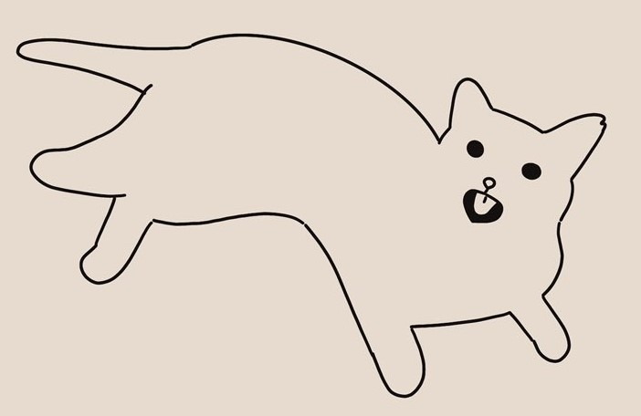

# OSCAR

**Ollie's Single Cell Analysis for the Romagnani Lab**

OSCAR is a comprehensive pipeline designed for processing single-cell RNA, ATAC, and multiome sequencing data.

## Features
- **Comprehensive metadata tracking**: Generate your metadata file [here](https://ollieeknight.github.io/OSCAR/) and keep track of sequencing runs.
- **FASTQ demultiplexing and QC**: Takes a raw bcl folder and demultiplexes FASTQ files, performs `fastqc` and `multiqc`.
- **scRNA pipeline**: Utilises `cellranger` for counting (with and without ADT/HTO), performs ambient-RNA correction with `CellBender`, and donor genotyping demultiplexing with `cellsnp-lite` and `vireo`.
- **scATAC pipeiline**: Utilises `cellranger` for counting, AMULET for doublet prediction, donor genotyping demultiplexing with `cellsnp-lite` and `vireo`, and for ASAP-seq performs ADT/HTO counting with `kallisto`.
- **Multiome pipeline**: All of the above
- **Multiple sequencing run integration**: Integrate sequenced libraries from several runs into one output folder.

## Getting Started

To get started with OSCAR, please follow these instructions:

1. Clone the repository:
   ```bash
   cd $HOME/work/bin/
   git clone https://github.com/ollieeknight/OSCAR
   ```

2. There are two Apptainer images: `oscar-count.sif` for the counting steps, and `oscar-qc.sif` for post-counting steps.
   ```bash
   mkdir -p ${TMPDIR}/OSCAR
   apptainer pull library://romagnanilab/oscar/oscar-count:latest --dir ${TMPDIR}/OSCAR/
   apptainer pull library://romagnanilab/oscar/oscar-qc:latest --dir ${TMPDIR}/OSCAR/
   ```

3. Reference genomes are also required, and build steps can be found under `reference/`.

   For any questions, please e-mail me at `oliver.knight@charite.de`!
